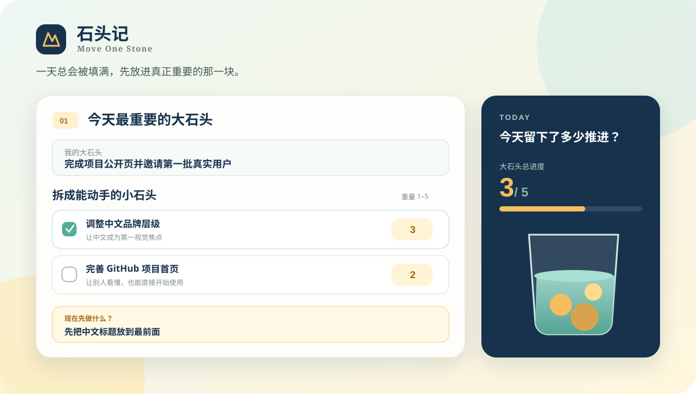

# 石头记 · Move One Stone

> **一天总会被填满，先放进真正重要的那一块。**

石头记是一款手机优先的每日推进工具。它不试图记录所有忙碌，而是帮助你选出真正重要的事情，把它拆成能够动手的小石头，并留下生活真正向前的部分。

[立即在线体验](https://moveonestone.qq172749863.chatgpt.site/) · [查看产品规划](./PRODUCT_PLAN.md)



## 为什么叫“石头记”

一天像一个透明的罐子：水和沙会自然填满时间，但真正重要的石头需要主动放进去。石头记记录的不是忙碌，而是那些真正推动事情、也推动生活向前的部分。

## 当前功能

- 每日大石头、完成标准与加权进度
- 小石头拆分、1–5 重量和“现在先做什么”启动动作
- 小石头完成动画、石头值、可选评价与成果图片
- 今日自由小石头
- 完成 7 个大石头后永久解锁第二块大石头
- 累计 5 天完成两块大石头后永久解锁第三块大石头
- 按日期查看历史记录
- JSON 数据导出、合并导入和覆盖导入
- 浏览器本地保存与可安装 PWA
- 透明水罐动画：放进重要的石头，水被挤出来

## 如何使用

1. 打开[在线版石头记](https://moveonestone.qq172749863.chatgpt.site/)。
2. 写下今天最重要的一块大石头和完成标准。
3. 把它拆成可以动手的小石头，并设置重量。
4. 只关注当前小石头，写下“现在先做什么”。
5. 完成后勾选，留下可选的评价和成果记录。

手机浏览器中可以使用“添加到主屏幕”，把它作为 PWA 使用，无需安装应用商店版本。

## 数据与隐私

数据默认只保存在当前浏览器的 `localStorage` 中，不会上传，也不会自动同步到其他设备。成果图片会经过压缩后写入本地数据。更换设备、浏览器或清理浏览器数据前，请先从“数据”页面导出 JSON 备份。

## 本地运行

需要 Node.js 22.13 或更高版本。

```bash
npm install
npm run dev
```

打开终端中显示的本地网址即可使用。生产构建：

```bash
npm run build
```

## 品牌表达

- 中文名称：石头记
- 英文名称：Move One Stone
- 中文核心句：一天总会被填满，先放进真正重要的那一块。
- 品牌价值：记录的不是忙碌，而是生活真正向前的部分。
- 英文口号：Make what matters doable.

## 当前阶段

这是一个持续迭代中的个人工具。目前优先验证真实使用体验，后续方向包括数据分析与复盘、可选的跨设备同步，以及真正的 AI 拆分建议。

## 许可说明

项目目前尚未添加开源许可证。代码可以公开查看，但复制、修改或再发布的授权将在许可方案确定后补充。
